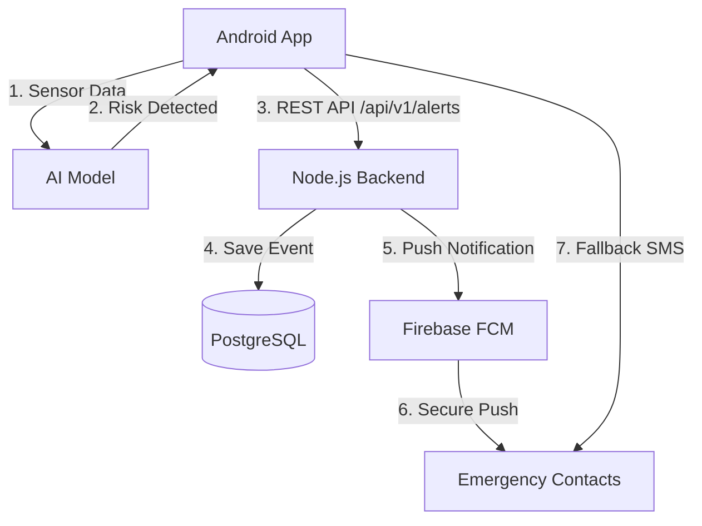

# AMAN-AI Integrated Architecture & Setup Guide

This document explains how the Android App, the Node.js Backend, and Firebase work together to provide intelligent protection.

## 🏗 System Architecture



## 📋 Components Role

1.  **Android App**: Monitoring sensors, running AI detection, and triggering the alert flow.
2.  **Node.js Backend**: Centralized hub for logging alerts permanently in a database and routing notifications.
3.  **Firebase**: Handles user authentication and serves as the secure bridge to deliver push notifications to contacts.

---

## ⚙️ Setup Instructions

### 1. Firebase Configuration (Mandatory)
Both the App and the Backend need Firebase to communicate.
*   **For the App**: Download `google-services.json` from Firebase Console and place it in `android/app/`.
*   **For the Backend**: Generate a Service Account Key (JSON) from Firebase Console (Settings -> Service Accounts) and place it in `backend/fcm_key.json`.

### 2. Backend & Training Setup (Docker)
The system uses Docker to manage the backend API and the AI training environment.
1.  Navigate to the `backend/` folder.
2.  Ensure `.env` contains your database credentials.
3.  Run the containers:
    ```bash
    docker-compose up --build
    ```
    *This starts the API (Node.js), the Database (PostgreSQL), and the **Training Environment (Jupyter)**.*

#### Accessing the Training Environment
Once Docker is running, you can access the AI training notebooks at:
*   URL: `http://localhost:8888`
*   Any changes you make to the notebooks or data in the `training/` folder will be saved automatically thanks to the Docker Volumes.

### 3. Android App Setup
1.  Open the project in Android Studio.
2.  **Configuration**: If testing on a physical device, update the IP address in `AlertRepository.kt` from `10.0.2.2` to your computer's local IP.
3.  **Build**: Sync Gradle and run the app.

---

## 🧪 Testing the MVP
1.  Start the **Backend** containers.
2.  Open the **App** on a device/emulator.
3.  Trigger the "Safety Status" button to simulate a high-risk event.
4.  **Verify**:
    - Check the terminal where Docker is running to see the alert being received.
    - Check the PostgreSQL database to confirm the alert record exists.
    - Confirm the "Attempting Push Notification" log appears in the backend.
